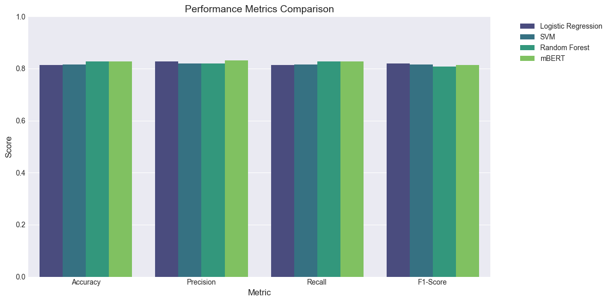
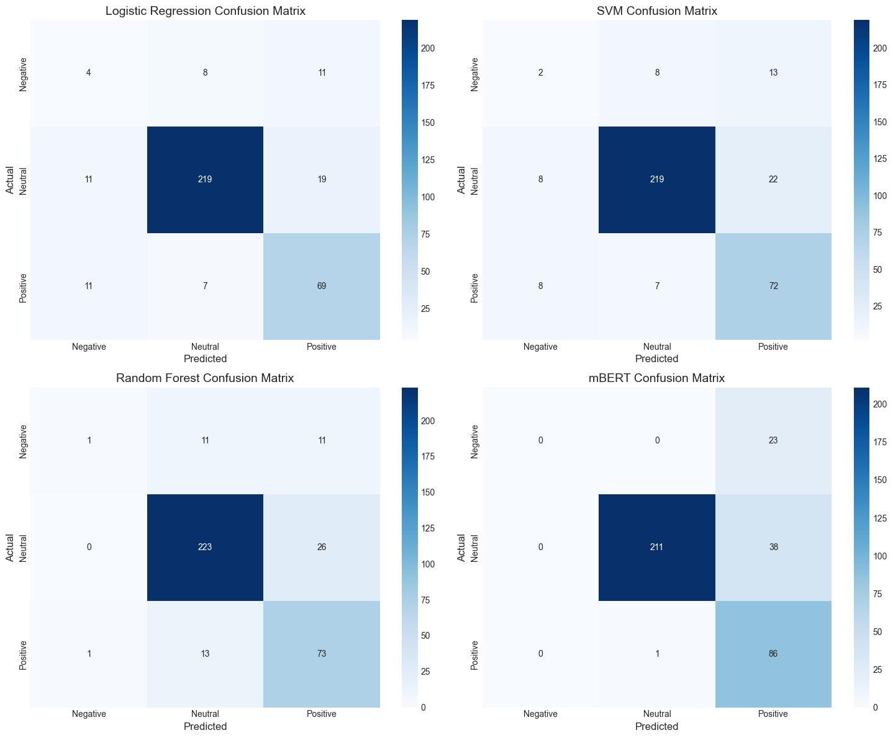
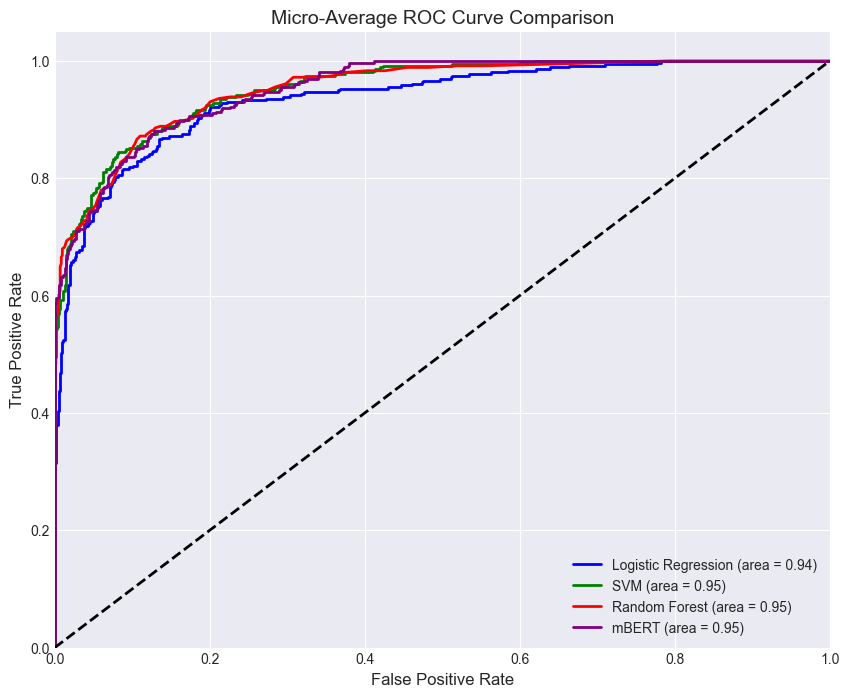

# Romanized Nepali Text Classification

This project implements and compares various machine learning models for sentiment analysis/classification of Romanized Nepali text. The goal is to classify text into Negative, Neutral, and Positive sentiment categories.

## Dataset
The dataset consists of **1,792** Romanized Nepali sentences labeled with sentiments:
*   **-1**: Negative
*   **0**: Neutral
*   **1**: Positive

## Methodology
The project explores both classical machine learning and modern transformer-based approaches:

1.  **Classical Models**:
    *   **Preprocessing**: TF-IDF Vectorization (unigrams and bigrams, max 5000 features).
    *   **Algorithms**:
        *   Logistic Regression
        *   Support Vector Machine (SVM)
        *   Random Forest
2.  **Deep Learning**:
    *   **Model**: **mBERT** (Multilingual BERT), fine-tuned for sequence classification.

## Results
The comparison of the four models reveals a highly competitive performance landscape, with Random Forest and mBERT tying for the highest accuracy at 82.73%, slightly outperforming both SVM (81.62%) and Logistic Regression (81.34%). While mBERT demonstrated the best predictive precision (83.21%), suggesting it is the most reliable at minimizing false positives, Logistic Regression surprisingly achieved the highest F1-Score (81.92%), indicating a superior balance between precision and recall for this specific dataset. Ultimately, while all models operated within a narrow performance band, mBERT stands out as the strongest candidate for deployment given its top-tier accuracy and precision, though the simpler Logistic Regression remains a remarkably robust baseline.

### Performance Metrics Table

| Model | Accuracy | Precision | Recall | F1-Score |
| :--- | :--- | :--- | :--- | :--- |
| **Logistic Regression** | 0.813370 | 0.827892 | 0.813370 | **0.819233** |
| **SVM** | 0.816156 | 0.819321 | 0.816156 | 0.815104 |
| **Random Forest** | **0.827298** | 0.819059 | **0.827298** | 0.808402 |
| **mBERT** | **0.827298** | **0.832099** | **0.827298** | 0.813046 |

## Visualizations

### 1. Class Distribution
An overview of the dataset balance.

### 2. Model Performance Comparison
A side-by-side comparison of accuracy, precision, recall, and F1-score.

### 3. Confusion Matrices
Detailed breakdown of true positives vs. misclassifications for each model.

### 4. ROC Curves
Micro-average ROC curves demonstrating the trade-off between sensitivity and specificity.

## Usage
To replicate the results:
1.  Ensure all dependencies are installed (`pandas`, `numpy`, `sklearn`, `transformers`, `torch`, `matplotlib`, `seaborn`, `plotly`).
2.  Run the Jupyter Notebook: `romanized_nepali_classification.ipynb`.
